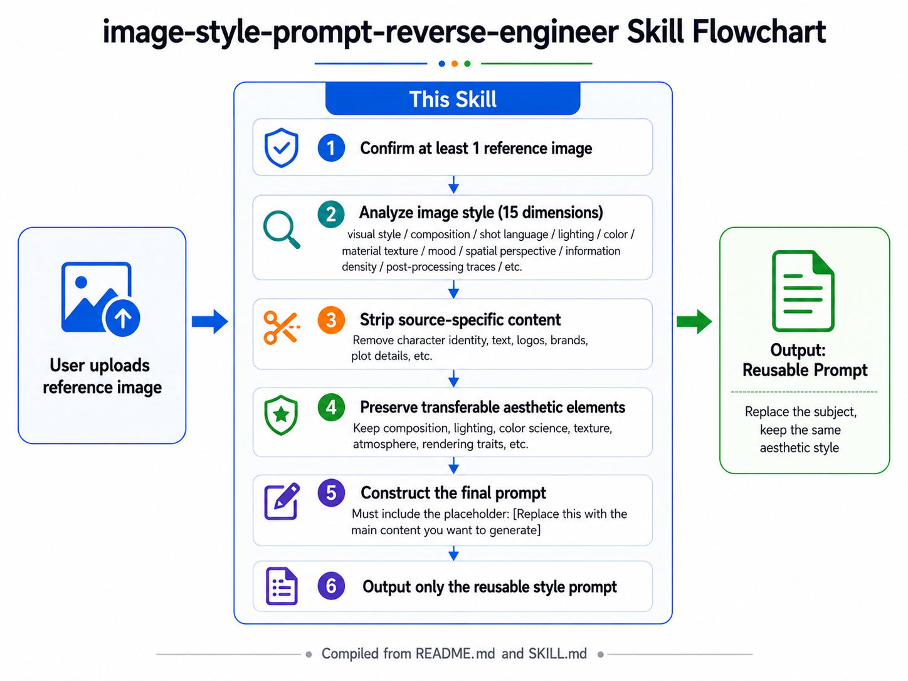

# image-style-prompt-reverse-engineer

[](https://skills.sh/Caph-dev/image-style-prompt-reverse-engineer)

Reverse-engineer the visual style of a reference image into a reusable AI image-generation prompt.

## What it does

This skill is for extracting the aesthetic language of a reference image while removing
source-specific content. Use it when the goal is to preserve the image's visual style,
composition, lighting, color science, texture, atmosphere, rendering traits, and cultural
context, while replacing the original subject with a new one.

## How it works



## Example works

**Want to know the prompts behind these examples? Use this skill.**

| | | |
|:---:|:---:|:---:|
|  |  |  |
|  |  |  |
|  |  |  |
|  |  |  |
|  |  |  |

### Example prompts

```text
Use $image-style-prompt-reverse-engineer to analyze this reference image and output only the reusable style prompt.
```

```text
Analyze the style of this image, remove the specific character and story details, and give me a reusable prompt for generating new subjects in the same aesthetic.
```

## Installation

### Recommended: skills CLI

Install with the [skills CLI](https://github.com/vercel-labs/skills) ([docs](https://www.skills.sh/docs)):

```bash
npx skills add Caph-dev/image-style-prompt-reverse-engineer
```

```bash
# Global install (available in all projects)
npx skills add Caph-dev/image-style-prompt-reverse-engineer -g

# Install to Cursor only
npx skills add Caph-dev/image-style-prompt-reverse-engineer -a cursor -y

# List skills in this repo without installing
npx skills add Caph-dev/image-style-prompt-reverse-engineer --list
```

The CLI detects your installed agents (Cursor, Claude Code, Codex, and [50+ more](https://github.com/vercel-labs/skills#supported-agents)) and wires the skill into the right directory.

### Manual install

**Ask your agent** — paste this prompt:

```text
Install the skill from https://github.com/Caph-dev/image-style-prompt-reverse-engineer.
```

**Codex** — clone into your skills directory:

```zsh
git clone https://github.com/Caph-dev/image-style-prompt-reverse-engineer ~/.codex/skills/image-style-prompt-reverse-engineer
```

Restart the agent after installing so it picks up the new skill.

## Repository structure

- `SKILL.md`: skill behavior, workflow, and output rules
- `agents/openai.yaml`: UI metadata
- `README.md`: GitHub-facing overview and examples

## Notes

This repository is intentionally small. The skill logic lives in `SKILL.md`;
this README is only for humans browsing the GitHub repo.

## License

This project is released under the [MIT License](./LICENSE).

## Acknowledgments

Thanks to:

- **@sallyn from Linux DO, this skill is actually his idea**
- [Linux Do](https://linux.do/)
